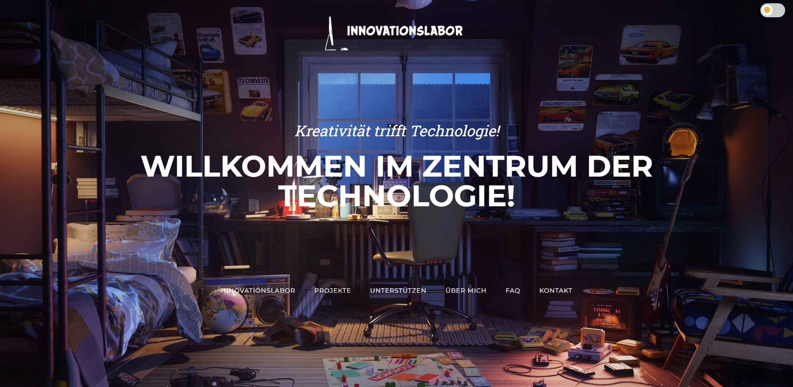
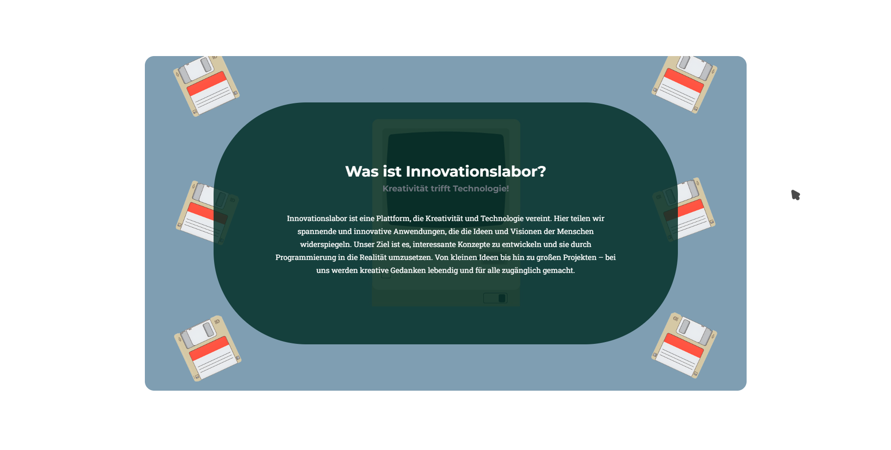
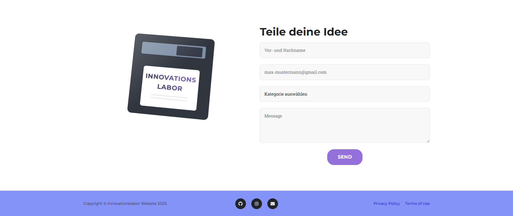

<div align="center">

# Innovationslabor

*Kreativität trifft Technologie!* — a personal portfolio and project showcase site, presenting a growing collection of web apps and tools in one place.

[](https://ef-krbg.github.io/innovationslabor/)
[](https://github.com/ef-krbg/innovationslabor/archive/refs/heads/main.zip)

</div>

---

## About

Innovationslabor is a personal portfolio and project hub. It presents a collection of small web apps and experiments in one place, alongside an about-me section, a contact form, and answers to common questions in five languages.

## Screenshots

<p align="center">
  
  
  
</p>

## Features

- **Project showcase** — a portfolio grid presenting projects like EMDb, Wetter App, Tic-Tac-Toe, and more, each with its own detail view.
- **Multi-language FAQ** — answers available in German, English, Spanish, French, and Turkish.
- **Light/dark theme toggle.**
- **Contact form** — reach out directly with project ideas, collaboration requests, feedback, or bug reports.
- **Support tiers** — optional supporter tiers for anyone who wants to help fund future projects.
- **About section** — background on the person behind the projects, with social links.

---

## Getting Started

Click **Use it Online** above to open the site straight in your browser — nothing to install.

Click **Download** to get a `.zip` of the site. Unzip it and open `index.html` in your browser to run it offline.


## Documentation

A more detailed project write-up is included in [`Projektdokumentation_Innovationslabor.pdf`](Projektdokumentation_Innovationslabor.pdf).

## Project Structure

```
innovationslabor/
├── index.html
├── css/
│   └── styles.css
├── js/
│   └── scripts.js
├── assets/
│   ├── favicon.ico
│   └── img/
│       ├── icon/          # language flags, cursor icon
│       ├── logos/         # partner & tech logos
│       └── *.png, *.jpg   # portfolio and page artwork
├── Projektdokumentation_Innovationslabor.pdf
├── LICENSE
└── README.md
```

## Tech Stack

HTML · CSS · [Bootstrap](https://getbootstrap.com/) · JavaScript · [Font Awesome](https://fontawesome.com/) · Google Fonts

## License

Distributed under the MIT License. See `LICENSE` for details.

---

<div align="center">

Enes Fatih Karabag — [github.com/ef-krbg](https://github.com/ef-krbg)

</div>
